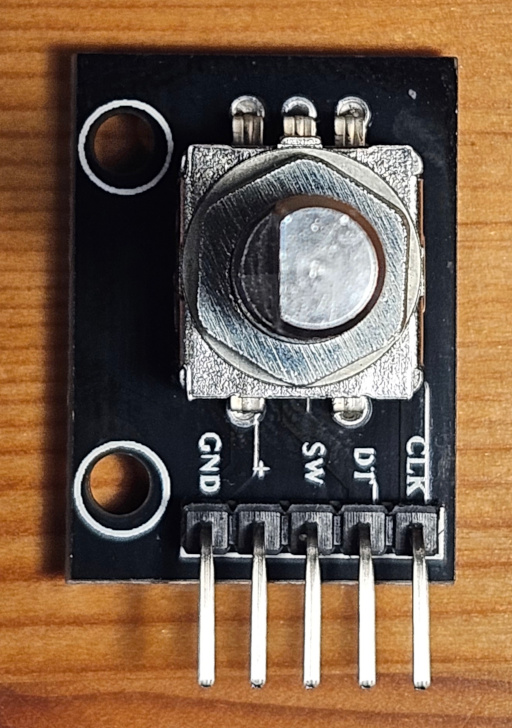
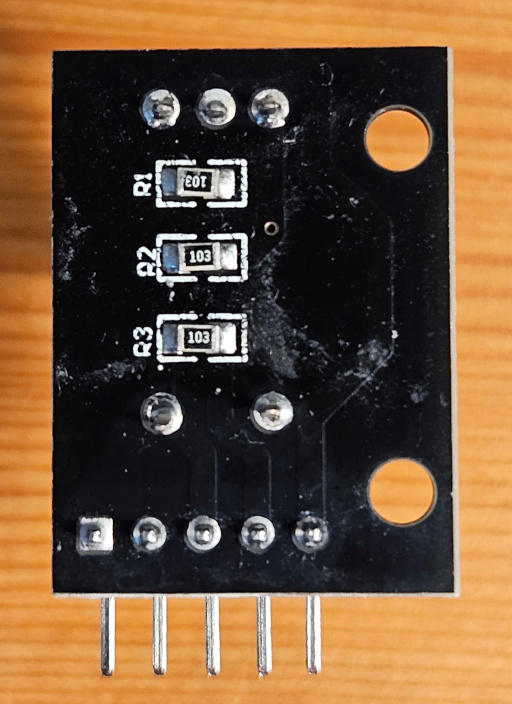

# KY040
An Arduino library for KY-040 rotary encoders. The library has debouncing and works in polling mode, with pin change interrupts or normal interrupts. In polling or pin change interrupt mode you can attach more then one rotary encoder to your Arduino Uno/Nano.

[PDF-Documentation](KY040.pdf)

Examples how to use the library
- [pollingNoInterrupts](/examples/pollingNoInterrupts/pollingNoInterrupts.ino)
- [pinChangeInterrupt](/examples/pinChangeInterrupt/pinChangeInterrupt.ino)
- [pinChangeInterruptPowerSave](/examples/pinChangeInterruptPowerSave/pinChangeInterruptPowerSave.ino)
- [pinChangeInterruptDualEncoders](/examples/pinChangeInterruptDualEncoders/pinChangeInterruptDualEncoders.ino)
- [withInterrupt](/examples/withInterrupt/withInterrupt.ino)

## License and copyright
This library is licensed under the terms of the 2-Clause BSD License [Copyright (c) 2023-2025 codingABI](LICENSE.txt). 

## Appendix
### Background
KY040 is a library for KY-040 rotary encoders. There are a lot of libraries existing for KY-040, but I found no library (at least 12/2023) which 

1. works without the need of interrupt enabled pins for the CLK (aka. A) and DT (aka. B)
2. and has a stable debouncing using a signal state table (without debouncing the KY-040 rotary encoder is a mess)

So I wrote my own library KY040, which was designed to work on an Arduino Uno/Nano, ATmega328, ESP32 and could work on other Arduino compatible MCUs too.

The KY040 library can:
- be used without interrupts in polling mode
- be used with pin change interrupts
- control more than one rotary encoders in polling or pin change interrupt mode on an Arduino Uno/Nano
- use any common pin digital pins for CLK and DT in polling or pin change interrupt mode
- be used with normal *attachInterrupt* interrupts (in this case you have to use Pins 2 and 3 on your Arduino Uno/Nano)
- be used with SLEEP_MODE_PWR_SAVE/SLEEP_MODE_PWR_DOWN sleep mode in combination with pin change interrupts
- debounce the rotary encoder by filtering out invalid signal sequences

### Valid clockwise sequence

```
        0 1 2 3
    --+   +----   High
CLK   |   |
      +---+       Low
      
    ----+   +--   High
DT      |   |
        +---+     Low
```
| Step  | Signal level for CLK/DT |
| ------------- | ------------- |
| 0  | Low/High  |
| 1  | Low/Low  |
| 2  | High/Low  |
| 3  | High/High  |

### Valid counter-clockwise sequence

```
       0 1 2 3
    ----+   +---  High
CLK     |   |
        +---+     Low
        
    --+   +-----  High
DT    |   |
      +---+       Low
```

| Step  | Signal level for CLK/DT |
| ------------- | ------------- |
| 0  | High/Low  |
| 1  | Low/Low  |
| 2  | Low/High  |
| 3  | High/High  |
 
### KY-040 Hardware



| Pins  | Comment |
| ------------- | ------------- |
| GND  | Ground  |
| +  |  Vcc |
| SW  | Switch button, not covered by this library. You can use *digitalRead* statements to check SW. Pin is pulled up to Vcc via the 10k pullup resistor R3 |
| DT  | aka. B, Pin is pulled up to Vcc via the 10k pullup resistor R2 |
| CLK  | aka. A, Pin is pulled up to Vcc via the 10k pullup resistor R1 |



The three 10k resistors R1,R2 and R3 pulls up the SW, CLK and DT pins up to Vcc. 
